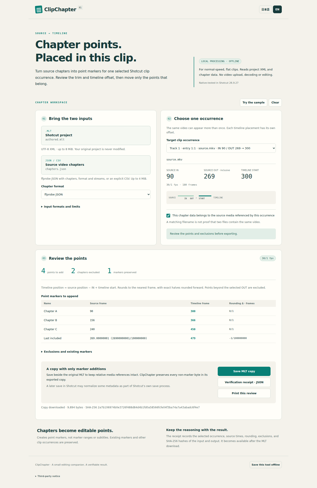

# ClipChapter

Offline source chapters → point markers for one selected Shotcut clip occurrence.

**Verified offline browser → official Shotcut 26.9.27 workflow.** The actual
browser-downloaded MLT passed native marker-table, real mouse/playhead, save/reopen
and exact shifted-marker negative checks. See [release evidence](docs/release.md).

## The bounded workflow

1. Open `dist/clip-chapter.html` locally. No server, account or network is needed.
2. Choose UTF-8 Shotcut MLT and ffprobe chapters JSON, or explicit CSV.
3. Select the exact clip occurrence and confirm the chapter data belongs to its
   source media. CSV also requires an explicit source-zero-origin confirmation.
4. Review source/timeline frames, nearest-frame half-up quantization, trim
   exclusions and preserved markers.
5. Download a marker-only MLT copy, then its hash-bearing JSON receipt. Save the
   copy beside the original MLT so relative media references continue to resolve.

Japanese/English interface, keyboard controls, 320/390px viewport layouts, printable
review and clean-start offline HTML download are covered by 29 browser checks.
The sample illustrates mapping and does not include a video file.

The tool does not read, execute, transcode or edit media. It does not turn chapters
into subtitles or range markers, and it does not infer which source file is
correct from a filename alone.

## Scope and fail-closed rules

- One explicitly selected normal-speed, flat occurrence only
- Inclusive source IN/OUT and preceding timeline entries/blanks
- Point markers; preserve existing full marker keys/properties and all bytes
  outside the ClipChapter marker patch
- Retiming, reverse/conversion provenance, proxies, nesting, selected unsupported
  transition overlap and nonzero source time origins are rejected
- Recognizes ordinary native tractor title metadata, the playlist audiolevel
  meter and known always-active/disabled compositors
- UTF-8 XML only; no DTD or entity declarations, external fetches or code execution
- MLT8MiB, chapter4MiB, XML50,000 elements/depth96, chapters10,000,
  one-line titles500 characters; output must remain within the same XML limits

**Byte preservation applies to ClipChapter's exported patch.** Shotcut's own
subsequent Save/Save As can normalize metadata. The native proof verifies that
marker values, clip trims and media references survive that native save; it does
not claim byte identity across Shotcut's save process.

## Input examples

ffprobe JSON must include `chapters`, `format.start_time` and nonempty `streams`
with zero `start_time` in every stream. Produce those fields with ffprobe's
`-show_chapters -show_format -show_streams -of json` options. Chapter `start` and
`time_base` are used as exact rational values.

CSV requires the header `source_seconds,title`, decimal source seconds and an
explicit confirmation that zero means the start of the referenced source video.

## Verification

```sh
npm ci --ignore-scripts
npm run verify
```

The native-only accepted run is
[37446224097](https://github.com/Masanori-Spec/clip-chapter/actions/runs/37446224097)
at `13311f8e241e854adea889275276195bae739593`.
It used the exact official archive, verified release metadata/size/SHA256, and
hosted Xvfb GUI authoring. All five native rows and ten actual mouse-click
Project/playhead seeks passed before/after native save and fresh-process reopen.
The exact Chapter B one-frame shift to367 was rejected by both independent
Python and the actual native GUI table. See `docs/native-feasibility.md`.

The [accepted browser/native run37452696942](https://github.com/Masanori-Spec/clip-chapter/actions/runs/37452696942)
authored a fresh official fixture, opened the offline HTML in sandboxed Chrome,
downloaded MLT through the actual UI, and routed those same bytes into the native
assertions. 38 core tests and 29 browser checks passed. The native-only feasibility
checkpoint remains documented separately from this full browser result.



## Notices

Original ClipChapter code and synthetic fixtures have no reuse license grant.
The bundled XML parser's legitimate third-party license is retained in
`THIRD_PARTY_NOTICES.txt` and inside the offline tool.
